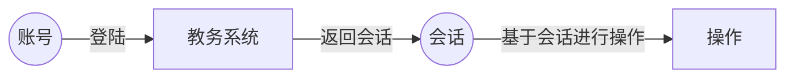

# GongGong

[](https://github.com/sky31studio)   

拱拱是一个基于网络爬虫的湘潭大学校园APP。本项目是GongGong的后端部分。

## 项目架构

项目整体分为三个部分：

- 网络爬虫
- 业务处理
- 前端展示

## 网络爬虫

> [!NOTE]
>
> 当前部分并未完全通过测试
>
> 如果你在使用的过程中发现了问题，欢迎通过 [Issues](https://github.com/sky31studio/GongGong/issues) 向我们反映。


网络爬虫部分代码在 `src/xtu_ems` 目录下。我们采用SDK的方式来允许其他人在本项目的基础上进行二次开发。
您可以在releases中下载对应版本的SDK并安装。

```shell
pip install ./xtu_ems-**.whl
```

我们当前开发支持的功能包括：

- 查询个人课表
- 查询个人基本信息
- 查询个人成绩
- 查询个人排名
- 查询考试安排
- 查询空闲教室
- 查询教学周历

### 如何使用

> [!TIP]
>
> **前提条件**：
>
> - 您有一个可用的湘潭大学校务系统学生账号
> - 您可以正常访问湘潭大学校务系统

在您成功安装版本之后，你便可以通过该SDK获取你在湘潭大学校务系统上的信息。SDK中主要使用到几个概念：**账号**、**校务系统**、 *
*会话**、**操作**。



我们这里以获取基本用户信息为例：

```python
username = "XTU_USERNAME"  # 你的校务系统账号
password = "XTU_PASSWORD"  # 你的教务系统密码

from xtu_ems.ems.account import AuthenticationAccount
from xtu_ems.ems.ems import QZEducationalManageSystem
from xtu_ems.ems.handler.get_student_info import StudentInfoGetter

account = AuthenticationAccount(username=username,
                                password=password)
ems = QZEducationalManageSystem()
session = ems.login(account)

handler = StudentInfoGetter()
resp = handler.handler(session)
print(resp.model_dump_json(indent=4))
```

我们也提供了异步执行的方式，你可以利用异步函数加速代码的执行效率（这在多个任务执行时极大的体现出差异）

```python
username = "XTU_USERNAME"  # 你的校务系统账号
password = "XTU_PASSWORD"  # 你的教务系统密码

from xtu_ems.ems.account import AuthenticationAccount
from xtu_ems.ems.ems import QZEducationalManageSystem
from xtu_ems.ems.handler.get_student_info import StudentInfoGetter

account = AuthenticationAccount(username=username,
                                password=password)
ems = QZEducationalManageSystem()
handler = StudentInfoGetter()


async def main():
    session = await ems.async_login(account)
    resp = await handler.async_handler(session)
    print(resp.model_dump_json(indent=4))


if __name__ == '__main__':
    import asyncio

    asyncio.run(main())
```


