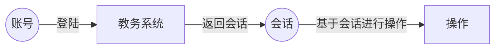

# GongGong

[](https://github.com/sky31studio)   

拱拱是一个基于网络爬虫的湘潭大学校园APP。本项目是GongGong的后端部分。

## 项目功能

- **网络爬虫**
    - 查询个人课表
    - 查询个人基本信息
    - 查询个人成绩
    - 查询个人排名
    - 查询考试安排
    - 查询空闲教室
    - 查询教学周历

- **平台服务**
    - 登陆账户
    - 获取上面的信息

## 快速上手

### 平台服务

#### 下载源码

```bash
git clone https://github.com/sky31studio/GongGong.git
```

#### 使用Docker环境启动

切换到根目录，即可

```bash
sudo docker-compose up -d
```

默认端口映射在***8000***端口上，可以通过`http://<host>:<port>/docs`查看接口文档。

### 网络爬虫SDK

> [!Tip]
>
> 湘潭大学教务系统是由[强智科技](https://www.qzdatasoft.com/)公司开发的大学教务系统，其业务逻辑部分大体相同，如果你想为其他学校的校务系统进行开发，你需要更改
`src/xtu_ems/ems/config.py`中的文件。
>
> 如果你在使用的过程中发现了问题，欢迎通过 [Issues](https://github.com/sky31studio/GongGong/issues) 向我们反映。

#### 下载安装

网络爬虫部分代码在 `src/xtu_ems` 目录下。我们采用SDK的方式来允许其他人在本项目的基础上进行二次开发。您可以在releases中下载对应版本的SDK并安装。

```shell
pip install ./xtu_ems-**.whl
```

也可以直接将项目**clone**下来

```bash
git clone https://github.com/sky31studio/GongGong.git
```

然后将src设置为源码根目录（**PyCharm**）,或者在**PYTHONPATH**中添加该目录。

#### 如何使用

> [!TIP]
>
> - 您需要有一个可用的[湘潭大学校务系统](https://jwxt.xtu.edu.cn/jsxsd)学生账号
>- 您需要可以正常访问[湘潭大学校务系统](https://jwxt.xtu.edu.cn/jsxsd)

在您成功安装版本之后，你便可以通过该SDK获取你在湘潭大学校务系统上的信息。SDK中主要使用到几个概念：**账号、校务系统、
会话、操作**。



我们这里以获取基本用户信息为例：

```python
username = "XTU_USERNAME"  # 你的校务系统账号
password = "XTU_PASSWORD"  # 你的教务系统密码

from xtu_ems.ems.account import AuthenticationAccount
from xtu_ems.ems.ems import QZEducationalManageSystem
from xtu_ems.ems.handler.get_student_info import StudentInfoGetter

# 创建一个校务系统账号
account = AuthenticationAccount(username=username,
                                password=password)
ems = QZEducationalManageSystem()
# 登陆校务系统
session = ems.login(account)

handler = StudentInfoGetter()
# 执行校务系统爬虫操作
resp = handler.handler(session)
print(resp.model_dump_json(indent=4))
```

我们也提供了**异步执行**的方式，你可以利用异步函数加速代码的执行效率（这在多个任务执行时极大的体现出差异）

```python
username = "XTU_USERNAME"  # 你的校务系统账号
password = "XTU_PASSWORD"  # 你的教务系统密码

from xtu_ems.ems.account import AuthenticationAccount
from xtu_ems.ems.ems import QZEducationalManageSystem
from xtu_ems.ems.handler.get_student_info import StudentInfoGetter

# 创建一个校务系统账号
account = AuthenticationAccount(username=username,
                                password=password)
ems = QZEducationalManageSystem()
handler = StudentInfoGetter()


async def main():
    # 登陆校务系统
    session = await ems.async_login(account)
    # 执行校务系统爬虫操作
    resp = await handler.async_handler(session)
    print(resp.model_dump_json(indent=4))


if __name__ == '__main__':
    import asyncio

    asyncio.run(main())
```

